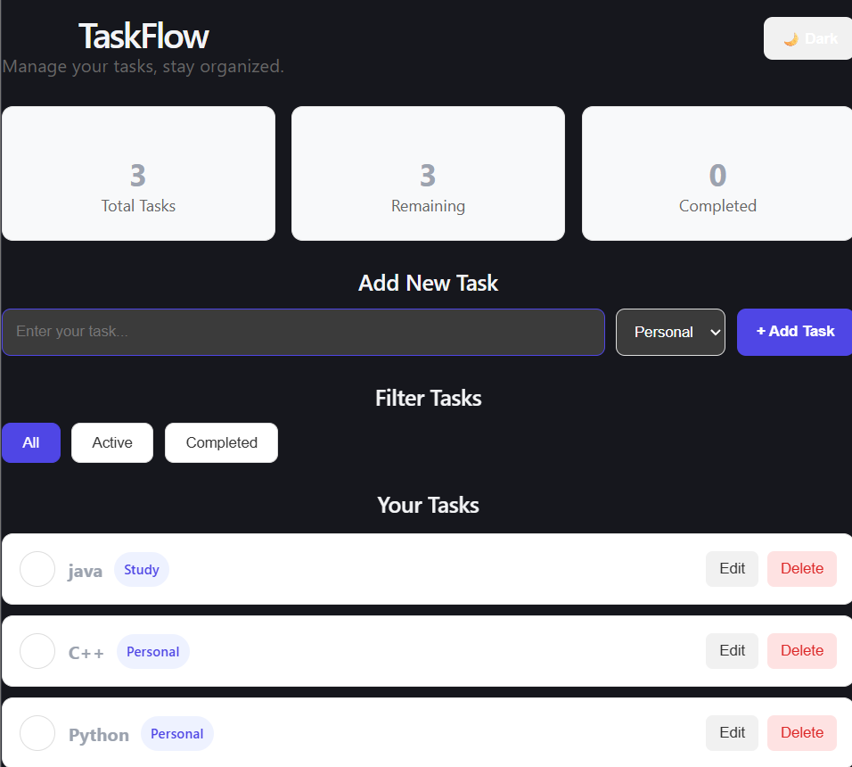
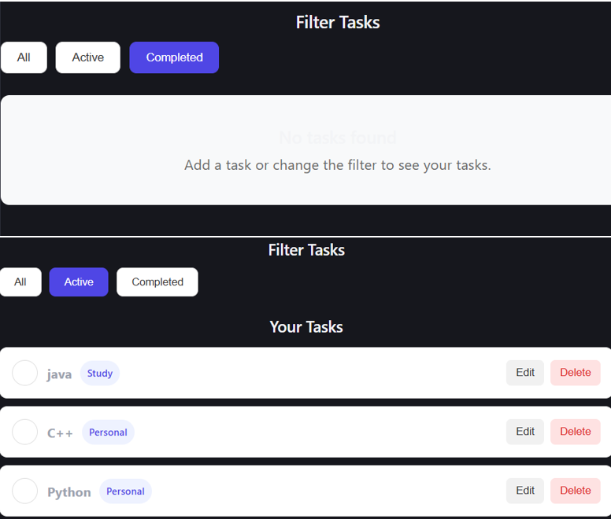
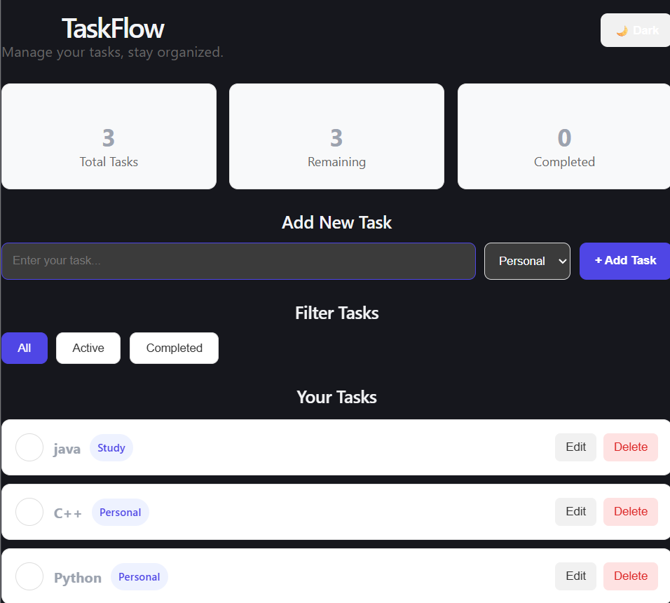

# TaskFlow – Personal Task Manager

TaskFlow is a responsive React-based personal task management application that helps users create, organize, track, edit, and complete their daily tasks. Tasks are stored using browser localStorage so they remain available after refreshing the page.

## Features

* Add new tasks
* Edit existing tasks
* Delete tasks
* Mark tasks as completed
* Filter tasks by All, Active, and Completed
* Organize tasks using categories
* Display task statistics
* Save tasks using localStorage
* Restore saved tasks after page refresh
* Dark/light mode
* Responsive user interface
* Controlled form inputs
* Conditional rendering
* Reusable React components

## Technologies Used

* React.js
* JavaScript
* HTML5
* CSS3
* Vite
* React Hooks

  * useState
  * useEffect
* Browser localStorage

## Project Structure

```text
src/
├── components/
│   ├── Header.jsx
│   ├── TaskForm.jsx
│   ├── TaskStats.jsx
│   ├── FilterBar.jsx
│   ├── TaskList.jsx
│   └── TaskItem.jsx
├── App.jsx
├── App.css
└── main.jsx
```

## Installation and Setup

Clone or download the project and open the project folder in a terminal.

Install the required dependencies:

```bash
npm install
```

Start the development server:

```bash
npm run dev
```

Open the localhost URL provided by Vite in your browser.

## Data Persistence

TaskFlow uses browser localStorage to save task information. When the application is refreshed, previously saved tasks are automatically loaded.
## Screenshots

## Main Dashboard



## Task Management



## Dark Mode




## Known Limitations

* Tasks are stored only in the user's browser using localStorage.
* There is no user account or cloud synchronization.
* Data may be lost if the browser's localStorage is manually cleared.

## Future Improvements

Possible future improvements include:

* Drag-and-drop task reordering
* Due dates and reminders
* Cloud synchronization
* User authentication
* More advanced task categories
* Notifications

## Author

Aditya Chaudhary

